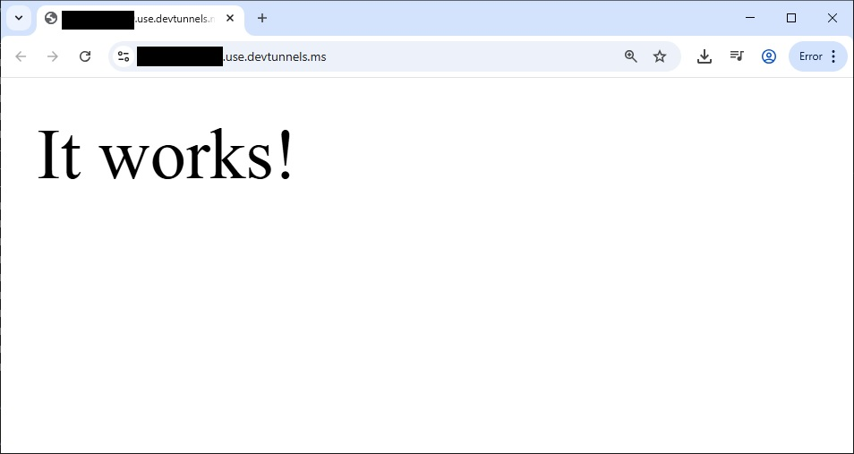

devtunnel-playground
====================
[Dev tunnels documentation | Microsoft Learn](https://learn.microsoft.com/en-us/azure/developer/dev-tunnels/)

### Direct link
- [Create and host a tunnel - Microsoft dev tunnels | Microsoft Learn](https://learn.microsoft.com/en-us/azure/developer/dev-tunnels/get-started?tabs=linux)
  - https://aka.ms/TunnelsCliDownload/win-x64
  - https://aka.ms/TunnelsCliDownload/osx-arm64-zip
  - https://aka.ms/TunnelsCliDownload/osx-x64-zip
  - https://aka.ms/TunnelsCliDownload/linux-x64

### Steps
1. `.\devtunnel user login -g -d`
2. `.\devtunnel host -p 3000 --allow-anonymous --protocol https`

### Lost the URL
1. `.\devtunnel user login -g -d`
2. `.\devtunnel list`
3. `.\devtunnel  connect ${Tunnel ID}` (`https://${Tunnel ID}.devtunnels.ms:${ port }/`)

### Alternatives
- [localtunnel/localtunnel: expose yourself](https://github.com/localtunnel/localtunnel)
- [cpolar官网-安全的内网穿透工具 | 无需公网ip | 远程访问 | 搭建网站](https://www.cpolar.com/)
